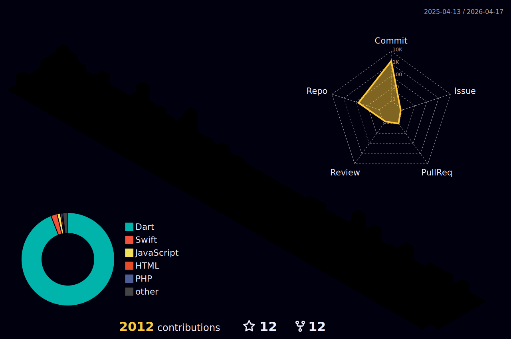

<!-- 🔥 Banner -->

  

<h1 align="center">👋 Merhaba, ben Görkem Öztürk</h1>

  🚀 <b>Flutter</b> • <b>HTML / CSS / JS</b> • <b>Firebase</b> • <b>API Entegrasyonu</b> 
  <b>Ürün geliştirici, maker ve tam anlamıyla bir proje insanıyım.</b>

---

### 💡 Hakkımda
- 💻 Çok yönlü geliştiriciyim; <b>Flutter</b> ile mobil uygulamalar, <b>HTML / CSS / JS</b> ile web arayüzleri, <b>Firebase</b> ile backend ve bildirim sistemleri geliştiriyorum.  
- ⚙️ API entegrasyonlarında deneyimliyim — sistemlerin birbirleriyle konuştuğu yapılar kuruyorum.  
- 💬 Şu anda AI destekli, kullanıcı odaklı projeler üzerinde çalışıyorum.  
- 🌍 Yeni teknolojileri sürekli deniyorum, UI/UX konusunda detaycıyım.  
- ☕ Kod yazarken lo-fi dinlerim, tasarım yaparken kahve soğur.

---

### 🚀 Son Projelerim
| Proje | Açıklama |
|-------|-----------|
| 🧠 **FlörtAI** | AI destekli ilişki analizi uygulaması – mesajlardan kişilik & ilişki raporu çıkarıyor. |
| 🍽 **POS701** | Restoranlar için Flutter tabanlı adisyon & sipariş sistemi. Offline çalışır. |
| 📦 **TodoBus** | İş yönetimi & CRM uygulaması. Görev, müşteri ve FCM bildirim entegrasyonu. |
| ⚡️ **Snorya** | Wikipedia içeriklerini AI ile özetleyen, kart tabanlı bilgi keşif uygulaması. |
| 🐾 **VetMeet (yakında)** | Veteriner randevu & pet sağlık yönetimi platformu. |

---

### 🧰 Teknolojiler

  
  
  
  
  
  
  
  
  

---

### 📊 GitHub İstatistikleri

  
  

  

---

### 🏆 Başarılar & Kupalar

  

---

### 🔥 Dinamik Görseller
<!-- Metrics -->

  

<!-- Activity Graph -->

  

<!-- 3D Contribution Graph -->

  

<!-- Snake Animation -->

  

---

### 📫 Bana Ulaş

  
  
  
  

---

<!-- Ziyaretçi Sayacı -->

  

